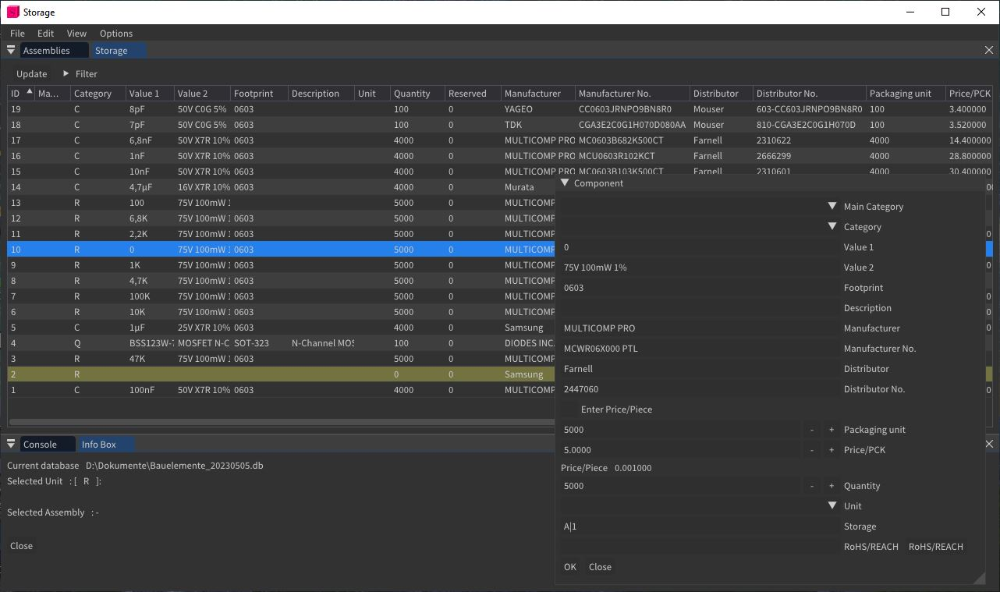
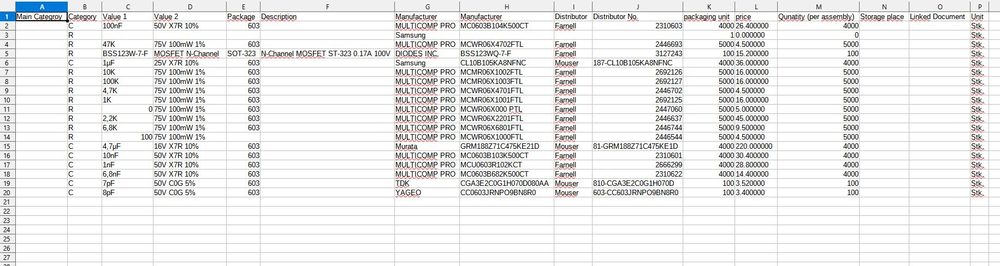
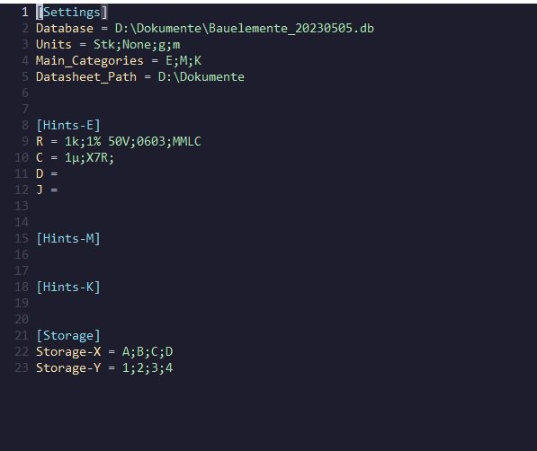

DESCRIPTION
-------------------------------------------
A super simple inventory tool. See Section "How to use" for further information

HOW TO USE
-------------------------------------------
1. Build the project
2. Open the Program
3. First Time you have to create a new database
4. Go View->Storage; A Window will pop up
5. After adding/changing components/assemblies please press the update button to get the newest changes from database
- You can add a component via: Edit->Component->New
- The following functionality is computed for one selected item from storage list
- select component and change it: Edit->Component->Update
- reserve component (general reservation): Edit->Component->Reserve
- release reservation (add reserved components back to storage): Edit-> Component -> Release Reservation
- remove reservation (reserved components were actually used): Edit->Component->Consume Reservation
- add/remove amount of component : Edit->Component-> ->Storage/<-Storage
- remove item from inventory. this is only possible if no assembly links to this component AND there is no reservation AND the item count is zero

- You can add a assembly via: Edit->Assembly->New
- View assemblies: View->Assemblies
- Add selected component to assembly: Edit->Assembly->Storage-> (for example 10 specific screws)
- View Bill of Materials of selected assembly: View->BOM (dont forget to press update when switching from one assembly to another)
- Produce an assembly (components count from assembly will be reduced): Edit->Assembly->Assembly->
- Add new component to storage and also link it to Assembly (one step instead of two): Edit->Assembly->Component->
- Inside BOM you can also reserve items with tolerance losses (specific reservation); Reservation only will be added for marked components 
- You can also export a BOM 
- Importing a BOM is a bit trickier: First u need the following csv standard (spacing with ";"): 

- Dont leave Unit Section empty. Otherwise the import fails
- Next the app scans for same (manufacturer and manufacturer no.) and similar components inside the inventory. There Will be popups if there this is the case. 
- Inside the popups you have differnt options: Discard import of specific component, select alternative and create new component (if there is a similar one) anyway

- Errors/warnings are shown in Console (view->Console)
- Selected database, component and assembly are shown in info box (View->Info Box)

CONFIGURATION
-------------------------------------------

- Settings-Database: automaticly stores last connection to database
- Settings-Units: Possible Units inside the application
- settings-Main_Categories: Create your own possible main categories (in example (E)lectrical, (M)echanical, (K)abel (german word for cables))
- Settings-Datasheet_Path: You are able to link a document to a specific component. This Path tells the application where to find all the Documents (assmunig there are all at the same place). You can open the document from within the app.
- Hints-E, Hints-M, Hints-K: Due to the naming, call yours Hints-.....; Adding the Categories here (R, C, D) and its standard way to add a component.
- Storage-Storage-X, Storage-Storage-Y: possible storage places to select from.

INFORMATION
-------------------------------------------

TODO - PLANS
-------------------------------------------
- There will be bug fixes, as soon as i find one 
- This is a hobby project. My company is testing the tool for internal inventory process
- make automatic updates on changes

ARCHITECTURE
-------------------------------------------
- ItemDatabase does all the SQL-things
- GuiDatabase is the main class for the GUI
- Language Support: English, German
- Want your own Language?: Create a Header and define the LANGUAGE during Compilation, e.g. #define GERMAN

DEPENDECIES
-------------------------------------------
Following dependcies:
- sqlite3
- sqlitecpp
- imgui
- GLFW/GLEW
- boost/circular_buffer
- boost_logger
	
HOW TO BUILD
-------------------------------------------
- this project has a premake5.lua file. so go ahead and build it with your build system of choice
- there is also an default.nix file for nix-shell; Built process on linux is not valited yet
- the res folder needs to be in the same folder as the .exe
- if you have problems to build. feel free to contact me

LICENSE
-------------------------------------------
This projects uses MIT LICENSE.